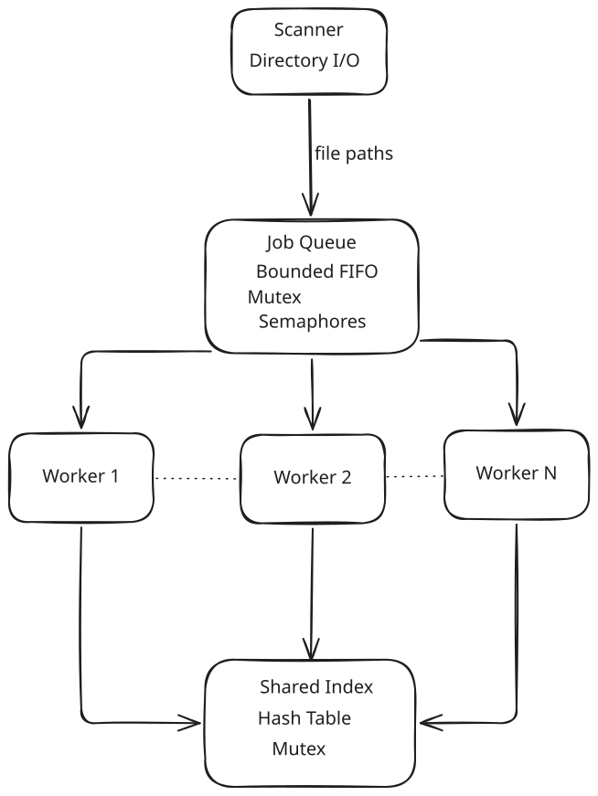

# File Executer

A multithreaded C application that scans text files, processes them concurrently,
and builds a shared inverted index using a bounded producer-consumer queue.

## Architecture

The system follows a producer-consumer architecture with a shared concurrent index.



## Key Features

- Multithreaded file processing with POSIX threads
- Bounded producer-consumer queue
- Semaphore-based blocking and back-pressure
- Shared thread-safe inverted index
- Hash-table based word lookup
- Incremental file processing with bounded memory usage
- Graceful worker shutdown using sentinel jobs
- Unit, integration, concurrency, and failure tests

## How It Works

The application uses one producer, a bounded producer-consumer queue, and a
fixed pool of consumers. The scanner produces file jobs while worker threads
consume those jobs and update one shared inverted index.

### 1. The scanner produces file jobs

`scanner_start` creates a dedicated scanner thread. That thread opens the input
directory with `opendir` and examines its immediate entries with `readdir`.
The scan is intentionally non-recursive: only entries in the requested
directory are considered. The scanner ignores `.` and `..` and accepts files
whose names end in `.txt`.

For each matching entry, the scanner builds a path in a fixed 512-byte buffer.
Path truncation is treated as an error rather than creating a corrupted job.
The path is copied into heap memory by `push_job`, so the queue owns its copy
until a worker removes the job.

### 2. The queue provides bounded FIFO scheduling

`JobQueue` is a circular array with `head`, `tail`, `count`, and a configured
`capacity`. It uses three synchronization objects:

- `empty_slots` counts available positions and blocks the producer when the
	queue is full.
- `full_slots` counts queued jobs and blocks consumers when the queue is
	empty.
- `mutex` protects the circular-buffer state while a slot is inserted or
	removed.

This combination gives FIFO behavior without busy-waiting and applies
back-pressure when workers cannot keep up with directory scanning. A normal
job owns a dynamically allocated file path. A shutdown job has
`shutdown == true` and no file path.

### 3. Shutdown is explicit

After a successful directory scan, the scanner inserts exactly `WORKER_COUNT`
shutdown jobs. Because shutdown jobs enter the same FIFO as normal jobs, every
queued file is removed before workers observe the shutdown signals.

The caller starts the worker pool after launching the scanner and waits for all
workers to finish, then joins the scanner thread. Each worker exits when it
receives its shutdown job. The worker frees the file-path allocation after
processing a normal job.

### 4. Workers process files concurrently

`worker_start` creates a fixed pool of four worker threads (`WORKER_COUNT` is
`4`) and joins all of them before returning. Every worker receives the same
queue and index through a small `Worker` context.

Each worker repeatedly:

1. Blocks in `pop_job` until a job is available.
2. Stops when the job is a shutdown job.
3. Opens and reads the assigned text file.
4. Frees the job's file path after processing.

The fixed pool avoids creating one thread per file while still allowing
independent files to be read in parallel.

### 5. Files are processed incrementally

Files are read with `fgets` into a 256-byte line buffer, so the complete file
does not need to be loaded into memory. `strtok_r` splits each line on spaces,
tabs, and line endings.

`clean_and_normalize` then removes punctuation from the beginning and end of a
token and converts the remaining characters to lowercase. Empty tokens are
discarded. The resulting word and the current file path are submitted to the
index.

### 6. The shared index stores inverted-file data

The index uses a fixed 101-bucket hash table. Words are hashed with the djb2
algorithm and collisions are handled with a singly linked list in each bucket.
Each `IndexEntry` contains:

- the normalized word;
- a dynamically sized array of files containing that word;
- the occurrence count for each file; and
- a link to the next word in the bucket.

The file array starts with capacity four and doubles when it becomes full.
Adding the same word for the same file increments its count. Adding the word
for a new file appends a new `FileInfo` record.

### 7. Synchronization protects index updates

All workers share one `Index`. Before adding a word, `read_file_contents`
locks the index mutex; it unlocks the mutex immediately after the update.
This makes linked-list changes, file-array growth, and occurrence increments
mutually exclusive while allowing file I/O and tokenization to happen outside
the critical section.

The index owns copies of both words and file names. Once all workers have
joined, `destroy_index` releases every file name, file array, index entry,
bucket array, and the index mutex.

## Concurrency Model

The application uses one scanner thread as the producer and several worker
threads as consumers. The scanner discovers files and adds jobs to the queue;
workers remove those jobs and update the shared index concurrently.

- **Fixed-capacity queue:** The queue cannot grow without limit. When it is
	full, the scanner waits for a worker to remove a job before adding another.
- **`empty_slots`:** Counts available positions in the queue and prevents the
	producer from exceeding its capacity.
- **`full_slots`:** Counts queued jobs and makes workers wait when there is no
	work available, instead of repeatedly polling the queue.
- **Queue mutex:** Protects `head`, `tail`, `count`, and the queue slots while
	a job is inserted or removed.
- **Index mutex:** Separately protects shared index modifications, including
	linked-list changes, file-array growth, and word-count increments.

Using separate synchronization for the queue and index keeps each critical
section focused. Workers can read and tokenize files concurrently, while only
the short index-update operation is serialized.

## Architecture Decisions

### Producer-consumer separation

Directory traversal and file processing are separate responsibilities. The
scanner only discovers files and enqueues paths; workers perform I/O,
tokenization, and indexing. This keeps directory traversal from being tied to
the processing speed of any individual file.

### Bounded work queue

The queue has a caller-selected capacity instead of growing without limit.
Semaphores provide blocking and back-pressure, while the mutex protects only
short queue operations. The circular representation reuses storage and avoids
shifting elements after every pop.

### Fixed worker count

The project uses four long-lived workers rather than creating threads for each
file. This limits resource usage and makes shutdown deterministic: one sentinel
is supplied for each worker.

### Sentinel-based shutdown

There is no shared stop flag or polling loop. Shutdown is represented as a
normal queue item, preserving FIFO ordering and allowing workers to block on
the same semaphore until work or termination is available.

### Single shared index with coarse-grained locking

All workers update one index protected by one mutex. The design favors simple,
correct ownership and collision handling over fine-grained bucket locks. The
critical section covers only the index mutation; file reading and tokenizing
remain concurrent.

### Incremental file processing

Workers process input using a fixed-size line buffer. This avoids loading
the entire file into memory, although input lines longer than the buffer
require multiple reads.

### Explicit ownership and cleanup

Queue insertion copies each file path. Popping transfers that allocation to
the worker, and the worker frees it after use. The queue and index destructors
also release any allocations still owned by their structures, which keeps
failure paths and normal shutdown leak-free.

## Requirements

- GCC or another C11-compatible compiler
- POSIX threads and semaphores (`pthread` and `semaphore`)

## Technical Details

| Component | Technology |
|---|---|
| Language | C11 |
| Concurrency | POSIX Threads |
| Synchronization | Mutexes, Semaphores |
| Data Structure | Bounded Circular Queue |
| Index | Hash Table |
| Filesystem | POSIX Directory API |
| Testing | Custom C Test Suite |
| Build System | Make |
| Compiler | GCC |

## Project Structure

```text
.
├── Makefile                 # Build and test commands
├── README.md                # Project documentation
├── docs/
│   └── architecture.svg     # Architecture diagram
├── include/                 # Public headers
│   ├── file_scanner.h
│   ├── index.h
│   ├── job_queue.h
│   ├── scanner.h
│   ├── test_helpers.h
│   ├── tokenizer.h
│   └── worker.h
├── src/                     # Application implementation
│   ├── file_scanner.c       # Directory scanning and file reading
│   ├── index.c              # Hash-table index
│   ├── job_queue.c          # Bounded circular job queue
│   ├── main.c               # Application entry-point placeholder
│   ├── tokenizer.c          # Token cleanup and normalization
│   └── worker.c             # Worker-thread management
├── tests/                   # Unit, integration, worker, and failure tests
│   ├── tests.c
│   ├── test_queue.c
│   ├── tests_worker.c
│   ├── integration_test.c
│   ├── failure_tests.c
│   ├── test_helpers.c
│   ├── *.txt                # Test input fixtures
│   ├── empty/               # Empty-directory fixture
│   └── stress/              # Multi-file stress fixtures
├── build/                   # Generated test executables
└── .vscode/                 # Editor and debugging configuration
```

## Build

Build all test executables from the repository root:

```sh
make
```

The current `src/main.c` is a placeholder, so the project is built through its
test executables for now.

## Run tests

Run the complete test suite from the repository root:

```sh
make test
```

For a clean rebuild:

```sh
make rebuild
```

The integration and failure tests use paths relative to the repository root.

## Testing

The project uses a custom C test suite. Running `make test` first builds all
test executables in `build/` and then runs them from the repository root.

The suite is divided by responsibility:

- **`queue_tests`** checks queue initialization, FIFO ordering, push/pop
	behavior, circular-buffer wraparound, and blocking when the queue is full or
	empty.
- **`worker_tests`** checks single and multiple file jobs, concurrent workers,
	blocking on an empty queue, shutdown jobs, and shared index updates.
- **`integration_test`** exercises the complete scanner-to-worker pipeline on
	the text fixtures and verifies indexed words, queue state, and index validity.
- **`failure_tests`** covers invalid directories, empty directories, many-file
	stress input, word-count correctness, and cleanup after failure conditions.

The tests use shared helper assertions and validate the internal queue and
index invariants in addition to checking expected words and occurrence counts.
For a clean test run, remove previous binaries first:

```sh
make rebuild
make test
```

## What I Learned

This project demonstrates practical experience with:

- C memory management
- Pointers and dynamic allocation
- POSIX threads
- Mutexes
- Semaphores
- Producer-consumer synchronization
- Bounded circular queues
- Thread lifecycle management
- Shared-state synchronization
- Hash tables
- Filesystem traversal
- Dynamic arrays
- Error handling
- Unit and integration testing
- Make-based builds
